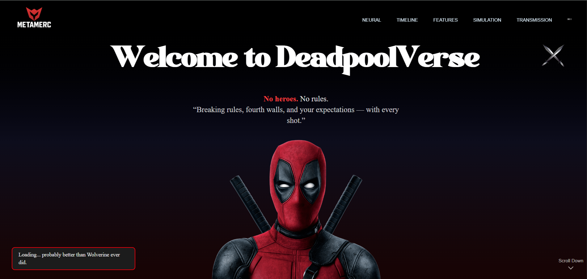

# 🧠 Deadpoolverse - A Cinematic React Experience

Welcome to the **Deadpoolverse**, a unique, highly stylized, and fully animated React-based website inspired by the wild, chaotic, and hilarious world of Deadpool. This project merges glitchy aesthetics, bold colors, and seamless animations using modern tools like **Tailwind CSS**, **GSAP**, and **React Icons**.

---

## 🚀 Features

* 🎮 **Cinematic Hero Section** with bold fonts and responsive layouts
* 🔀 **Smooth GSAP Animations** triggered on scroll
* 🔥 **Futuristic Media Section** with video + hover-animated fight image cards
* 🥨 **Deadpool's Arsenal Showcase** with animated weapon cards
* 🧠 **Fourth-Wall Breaking Outro** CTA with glitch-inspired styling
* 📱 **Responsive & Dark Themed** throughout
* 🕹 **React Icons for Social Links**
* ✨ Fully accessible and mobile-friendly design

---

## 🖼 Preview Screenshot




## 🛠 Built With

* **React** – for fast, modular UI development
* **GSAP & ScrollTrigger** – for powerful scroll-based animations
* **Tailwind CSS** – for utility-first styling
* **React Icons** – for lightweight, scalable iconography

---

## 📂 Project Structure

```
/src
  /components
    └── Hero.jsx
    └── DeadpoolMedia.jsx
    └── DeadpoolArsenal.jsx
    └── DeadpoolOutro.jsx
    └── DeadpoolFooter.jsx
/public
  /images
  /videos
  /screenshots
```

---

## 📸 Adding Your Own Content

* **Images** → Put them in `/public/images`.
* **Videos** → Drop cinematic clips in `/public/videos`.
* **Screenshot for README** → Save as `deadpoolverse-preview.png` inside `/public/screenshots`.

---

## 🧪 Development Setup

```bash
git clone https://github.com/yourusername/deadpoolverse.git
cd deadpoolverse
npm install
npm run dev
```

---

## 📣 Credits

* Deadpool character and likeness © Marvel
* Fonts: Orbitron, Inter, Negra
* Icons from [React Icons](https://react-icons.github.io/react-icons)

---

## 🥨 Made By

**Krishna Sahu**
Email: [krishna.sahu.work@gmial.com]


---

## 🧨 License

This is a fan-made, non-commercial project intended for educational and creative showcase only.

> **"Maximum Effort! Also, minimum planning." – Deadpool**
